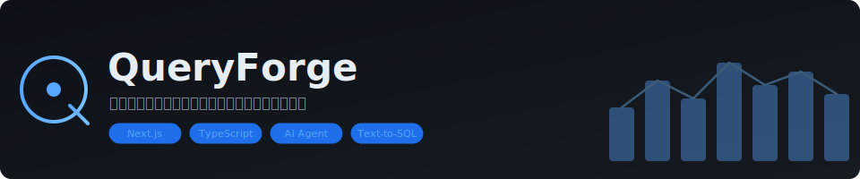

# QueryForge

<p align="center">
  
</p>

<p align="center">
  <a href="https://queryforge-production-8d6f.up.railway.app">在线演示</a> · 
  <a href="docs/speaker-notes.md">讲稿</a> · 
  <a href="docs/QUINTE-METHODOLOGY.md">审查方法论</a>
</p>

---

**面向业务团队的 AI 数据分析智能体。** 自然语言提问 → SQL → 图表 + 分析师级文字报告。基于 [Olist 真实电商数据](https://www.kaggle.com/datasets/olistbr/brazilian-ecommerce)（99K 订单）验证。

## 产品能力

- **自然语言取数** — 中文提问，自动生成 SQL、图表和分析报告
- **数据看板** — 8 个核心指标实时加载
- **分析师级分析** — 数据结论 + 趋势对比 + 业务建议 + 局限性说明
- **智能纠错** — SQL 出错自动诊断、修正、重试
- **指标库** — 分析师预设指标，业务一键查询，口径统一

## 三层架构

1. **受控语义层** — 分析师定义指标，系统匹配生成 SQL，不靠 LLM 猜表名
2. **验证式 Agent 循环** — SQL → AST 验证 → 只读执行 → 结果分析 → 自纠正
3. **企业数据平面** — Schema-only 模型暴露、只读数据库、AST 级安全校验

数据合规：LLM 只看表名不看数据 · 只允许 SELECT · 自动 LIMIT · 路线图含 RLS/PII 脱敏/审计日志/SSO

## 真实数据

99,441 订单 · 96,096 用户 · 32,951 商品 · 74 品类 · 5 地区 · R$1,601 万营收

## 演示示例

"各地区月度销售额趋势" · "各地区客单价差异分析" · "复购用户的品类跨越路径" · "渠道表现对比分析"

## 快速开始

```bash
git clone https://github.com/eric-stone-plus/queryforge.git
cd queryforge && npm install
echo "AI_API_KEY=your_key" > .env.local
# Configure your AI provider in .env.local

npm run dev
```

## License

MIT
