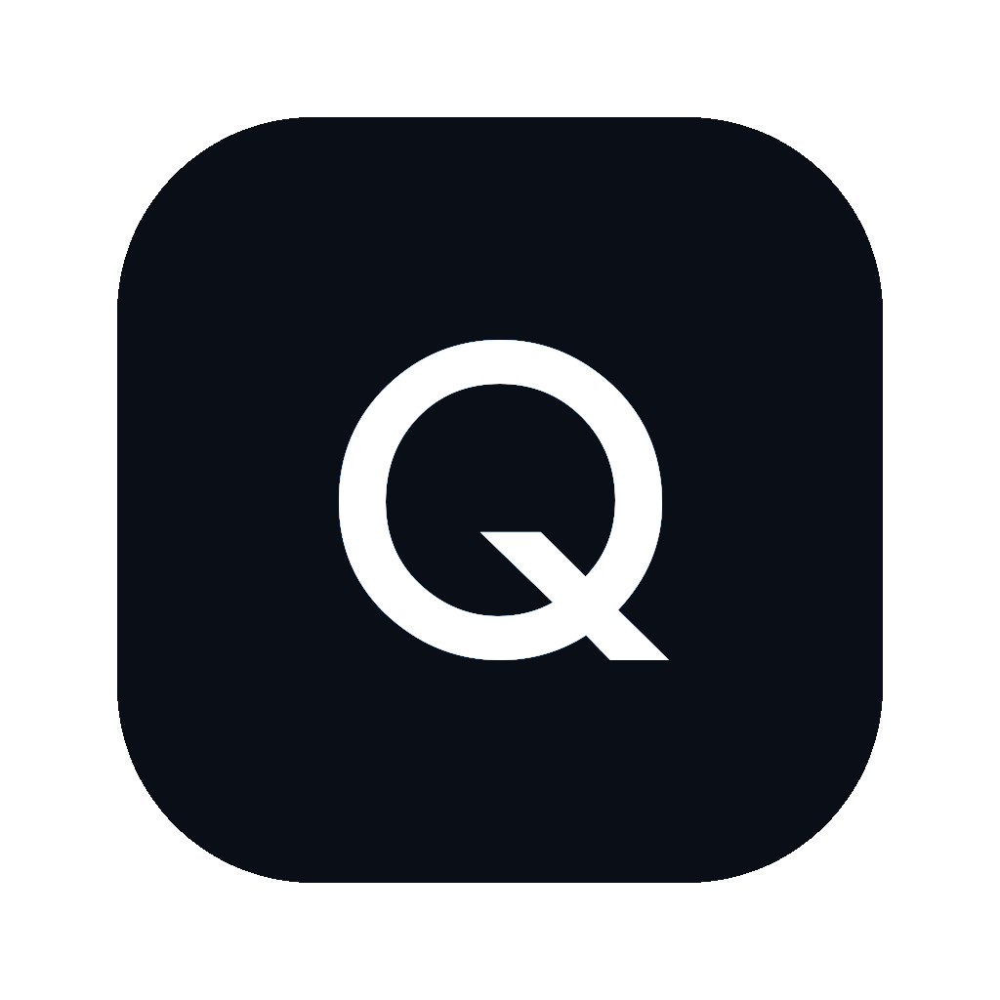

# QueryForge

<p align="center">
  
</p>

<h3 align="center">让业务部门自助取数，解放数据分析师的重复需求</h3>

QueryForge is an AI data analysis agent for teams that need answers faster than the analytics queue can move.

It turns natural-language business questions into SQL, executes them against a governed SQLite data model, and returns charts plus a concise explanation. Analysts set up the data, metrics, and business definitions once; business users can then self-serve repetitive reporting requests without learning SQL or waiting for a dashboard change.

[Live demo](https://queryforge-production-8d6f.up.railway.app) · [macOS desktop app](https://github.com/eric-stone-plus/queryforge/releases)

## Why QueryForge

Most analytics teams spend too much time answering the same operational questions:

- "Can you add one more breakdown?"
- "Can I get this by region instead?"
- "Why did revenue dip last week?"
- "Can you send the SQL for this metric?"

QueryForge shifts that work into a controlled self-service flow. Analysts remain responsible for the data model and metric definitions. Business teams ask questions in plain language and get query results, visualizations, and explanations from the same approved data layer.

## What It Does

- Converts natural-language questions into SQLite `SELECT` queries.
- Streams query progress so users can see the agent move from intent to SQL to results.
- Generates charts for the returned dataset.
- Provides short business-facing explanations of the result.
- Includes a reusable metric sidebar for analyst-approved definitions.
- Automatically retries failed SQL with an AI self-correction loop.
- Runs as both a hosted web app and a macOS desktop app.

## How It Works

```text
User question
  -> MiMo v2.5 Pro interprets the request
  -> QueryForge generates SQL
  -> SQL is validated and constrained
  -> better-sqlite3 executes against the demo database
  -> Results are visualized and explained
```

If the generated SQL fails, QueryForge sends the database error back to the model, asks for a corrected query, validates it again, and retries automatically. The user sees the correction status instead of a dead-end error.

## Stack

| Area | Technology |
| --- | --- |
| Web app | Next.js 14, React, TypeScript, Tailwind CSS |
| AI | MiMo v2.5 Pro, Vercel AI SDK, OpenAI-compatible provider |
| Data | better-sqlite3, SQLite demo warehouse, node-sql-parser |
| Visualization | Recharts |
| Runtime | Next.js API routes, SSE progress streaming |
| Deployment | Railway |
| Desktop | macOS app distributed through GitHub Releases |
| Quality | QUINTE protocol: 5 independent AI review agents, 3 rounds, 39 reports, 5 P0 bugs found |

## Local Development

```bash
git clone https://github.com/eric-stone-plus/queryforge.git
cd queryforge
npm install
```

Create `.env.local`:

```bash
MIMO_API_KEY=your_api_key
MIMO_BASE_URL=https://token-plan-cn.xiaomimimo.com/v1
```

Start the development server:

```bash
npm run dev
```

Open `http://localhost:3000`.

## Project Structure

```text
src/
  app/
    api/chat/route.ts      Streaming agent endpoint
    api/query/route.ts     SQL execution endpoint
    api/schema/route.ts    Schema metadata endpoint
    page.tsx               Main product surface
  components/
    ChatPanel.tsx          Natural-language query interface
    Dashboard.tsx          KPI and chart dashboard
    MetricSidebar.tsx      Analyst-defined metric shortcuts
  lib/
    agent.ts               Prompting, SQL generation, self-correction
    db.ts                  SQLite connection and query helpers
    demo-cache.ts          Demo fallback data
data/
  ecommerce.db             Seed SQLite warehouse
desktop/
  QueryForge.swift         macOS desktop wrapper
```

## Safety Model

QueryForge is designed around a read-only analytics workflow:

- Only single-statement `SELECT` queries are accepted.
- SQL is parsed before execution.
- Queries are automatically constrained with `LIMIT 500` when no limit is provided.
- Database access is read-only from the product surface.
- API keys are supplied through environment variables.

This is not a replacement for warehouse-level permissions or production data governance. Treat it as an application layer on top of data access controls you already trust.

## Demo

The hosted demo uses an ecommerce SQLite dataset with orders, order items, products, categories, users, and regions.

Try questions such as:

- "Show monthly revenue this year."
- "Which product categories have the highest revenue?"
- "Compare revenue by region."
- "Find the top products by order volume."

Live demo: [queryforge-production-8d6f.up.railway.app](https://queryforge-production-8d6f.up.railway.app)

## Desktop App

The macOS desktop build is published on the project's [GitHub Releases](https://github.com/eric-stone-plus/queryforge/releases) page.

## License

MIT
