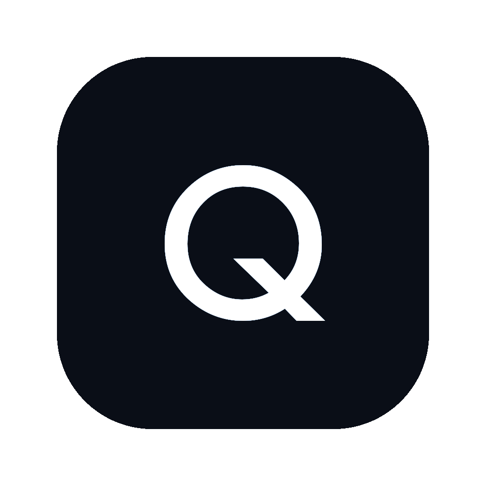

# QueryForge

<p align="center">
  
</p>

<h3 align="center">让业务部门自助取数，解放数据分析师的重复需求</h3>

<p align="center">
  <a href="https://queryforge-production-8d6f.up.railway.app">在线演示</a> · 
  <a href="https://github.com/eric-stone-plus/queryforge/releases">macOS 桌面版</a> · 
  <a href="docs/DEV-ROADMAP.md">开发路线</a>
</p>

---

## 解决什么问题

数据分析师的日常：

- 业务侧反复提同样的取数需求
- 同一个指标，不同部门问 10 遍，改 10 遍
- 分析师 80% 时间在取数，只有 20% 做深度分析
- 业务等排期，简单需求也要等 1-3 天

**QueryForge 让分析师调整好底层数据和指标后，业务部门自己用自然语言抓取数据、生成看板、做异常分析、获取决策建议。**

分析师从"取数工具人"变成"数据架构师"。

## 产品能力

**自然语言取数** — 业务人员用中文提问，系统自动理解意图、查询数据库、返回可视化图表。

**数据看板自动生成** — 8 个核心经营指标 + 6 个图表面板，全部从真实数据库实时加载。

**指标异常分析** — 系统自动检测数据异常，给出可能原因和分析方向。

**决策建议** — 基于数据趋势和异常，提供业务决策方向和建议。

**分析师预设指标库** — 分析师预设常用指标和查询口径，业务人员一键复用。

**智能纠错** — 查询出错时系统自动修正并重试，用户看到修正过程和结果。

## 工作原理

```
业务人员提问 → 理解意图 → 查询数据库 → 可视化 + 分析 + 建议
                    ↑                              │
                    └──── 出错则自动修正 ←──────────┘
```

## 技术路线

| 层 | 技术 |
|---|---|
| 前端 | Next.js 14 · Tailwind · Recharts · 深色/浅色主题 |
| 后端 | Next.js API Routes · 流式进度推送 |
| AI | MiMo v2.5 Pro · Vercel AI SDK · 智能纠错 |
| 数据 | better-sqlite3 · SQL 安全校验 · 自动限制 |
| 部署 | Railway 云端 24/7 · macOS 桌面版（SwiftUI） |
| 质量 | [QUINTE](https://github.com/eric-stone-plus/QUINTE) 对抗审查协议 |

## 快速开始

```bash
git clone https://github.com/eric-stone-plus/queryforge.git
cd queryforge && npm install

echo "MIMO_API_KEY=your_key" > .env.local
echo "MIMO_BASE_URL=https://token-plan-cn.xiaomimimo.com/v1" >> .env.local

npm run dev
# 访问 http://localhost:3000
```

## 项目结构

```
src/
  app/api/chat/route.ts     # 流式对话 API
  app/api/query/route.ts    # 数据查询 API
  app/page.tsx              # 主页：指标看板 + 对话面板
  components/ChatPanel.tsx   # 对话界面 + 图表渲染
  components/Dashboard.tsx   # 多图面板
  components/MetricSidebar.tsx # 分析师预设指标库
  lib/agent.ts              # AI 推理 + 智能纠错
  lib/db.ts                 # 数据库连接
  lib/demo-cache.ts         # 离线缓存
data/ecommerce.db           # 示例数据（10K 订单 · 500 商品）
desktop/
  QueryForge.swift          # macOS 桌面版
  server.js                 # 内嵌本地服务
docs/                       # 项目文档
  DEV-ROADMAP.md            # 开发路线
  QUINTE-METHODOLOGY.md     # 对抗审查方法论
  PROJECT-MEMO.md           # 项目备忘
assets/                     # 设计资源
  QueryForge-Pitch.pptx     # 路演 PPT
debates/                    # 审计报告
  round1-code-audit/        # 代码审计
  round2-direction/         # 方向决策
  round3-polish/            # 打磨策略
```

## 安全机制

- 只允许查询操作，不允许修改数据
- 查询自动限制返回条数，防止卡死
- 数据库只读连接
- API Key 通过环境变量注入，不硬编码
- 查询出错时自动修正，不给用户返回错误

## 演示

**网页版**：[queryforge-production-8d6f.up.railway.app](https://queryforge-production-8d6f.up.railway.app)

**桌面版**：[Releases](https://github.com/eric-stone-plus/queryforge/releases)（macOS x86_64，双击即用）

## License

MIT
